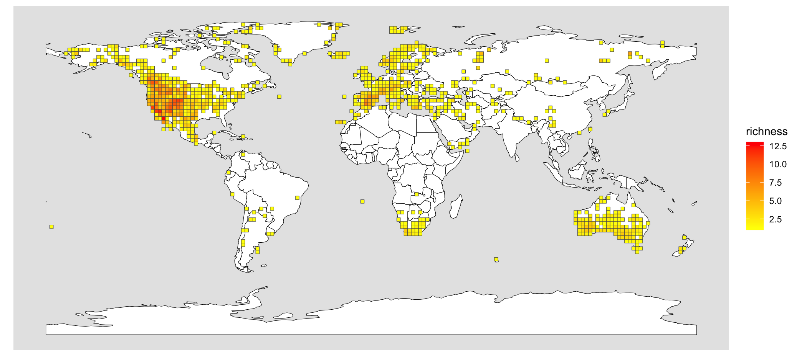

# GlobalSpeciesRichness_Psora
Code used to map Global Species Richness of *Psora* based on this tutorial 
"[Obtaining occurrence and phylogeny data in R](https://github.com/joelnitta/spatial-phy-workshop/blob/main/tutorials/occ_phy.md)" by [Professor Joel Nitta](https://github.com/joelnitta).

## PhD Thesis map of *Psora*

I used this figure in my PhD Thesis, "[Delimiting Diversity of Lichenized Lecanorales](https://www.researchgate.net/publication/396451697_Delimiting_Diversity_of_Lichenized_Lecanorales)".

