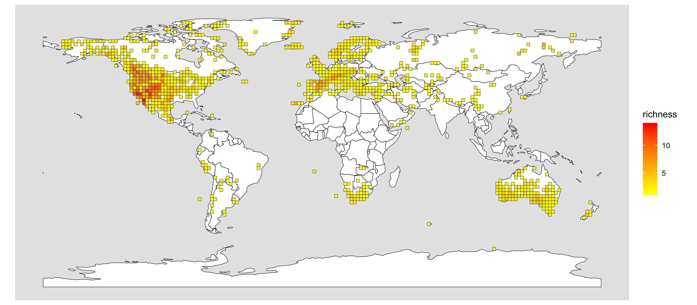

# GlobalSpeciesRichness_Psora
Code used to map Global Species Richness of *Psora* based on this tutorial 
"[Obtaining occurrence and phylogeny data in R](https://github.com/joelnitta/spatial-phy-workshop/blob/main/tutorials/occ_phy.md)" by [Professor Joel Nitta](https://github.com/joelnitta).

## PhD Thesis map of *Psora*

**Figure 15** 
Raw species richness data for *Psora* from the Global Biodiversity Information Facility (GBIF.org,
2024a Paper II), plotted using R. Regions without data do not necessarily indicate lack of *Psora*. Note: Dataset is
not cleaned to provide an accurate representation of currently available public data

I used this figure in my PhD Thesis, "[Delimiting Diversity of Lichenized Lecanorales](https://www.researchgate.net/publication/396451697_Delimiting_Diversity_of_Lichenized_Lecanorales)".

"Raw global species richness of *Psora* ([GBIF.org](https://www.gbif.org/), 2024a) was assessed using R v. 4.2.3 and R
Studio v. 2023.12.0+369 (Posit Team 2023). We filtered the dataset for missing species names.
We then used points2comm from the package [phyloregion](https://phyloregion.com/) (Daru et al. 2020) with resolution
2. This was converted to a shapefile using st_as_sf in [sf](https://r-spatial.github.io/sf/) (Pebesma 2018; Pebesma & Bivand
2023), and plotted using [gglot2](https://ggplot2.tidyverse.org/) (Wickham et al. 2020) using a map from [rnaturalearth](https://github.com/ropensci/rnaturalearth)
(Massicotte & South 2024) to produce (the) Fig(ure)."

## Data comparison between 2024 and 2026
The initial [GBIF Occurrence Download](https://doi.org/10.15468/dl.6zrq67) was accessed on 02 December 2024. 

I decided to redo these analyses with a new [GBIF Occurrence Download](https://doi.org/10.15468/dl.8m2kxm) from 30 May 2026.

